# Reverie Desk — Business Workflows

Each workflow below documents the **trigger**, **preconditions**, **step-by-step flow**, **state transitions**, and **side effects** observed in the codebase. State diagrams reflect the actual `ALLOWED_TRANSITIONS` tables in each service.

> Status field names match Prisma enums (`SalesOrderStatus`, `AppointmentStatus`, etc.). Side effects come from the actual transactional code paths.

---

## 1. Lead Conversion

**Trigger**: `POST /leads/:id/convert` (`LeadsService.convert`).

**Preconditions**:

- Caller has role: `ADMIN`, `SUPER_BRANCH_MANAGER`, `BRANCH_MANAGER`, `TELESALES`, or `CS` (controller-level).
- Branch scope passes (`assertBranchAccess(user, lead.branchId)`).
- Lead status is **not** `WON`, `LOST`, or `ARCHIVED`.

**Flow**:

1. Load lead (with current branch, owner).
2. If `lead.customerId` already set → reuse that customer.
3. Else if `dto.phone` or `dto.email` provided → look up via `customer.findByPhoneOrEmail`.
4. Else → mint a new customer in the same transaction:
   - Inside `prisma.$transaction`, take advisory lock `customer-code` and call `generateMonthlyCode(tx, 'CUST', 'customer-code')` → `CUST-YYYYMM-####`.
   - Create `Customer` with `currentBranchId = lead.branchId`.
5. Update lead → `status = WON`, `customerId = customer.id`, `convertedAt = now`.
6. Audit: `Lead.update`, `Customer.create` (when minted).

**State transitions**:

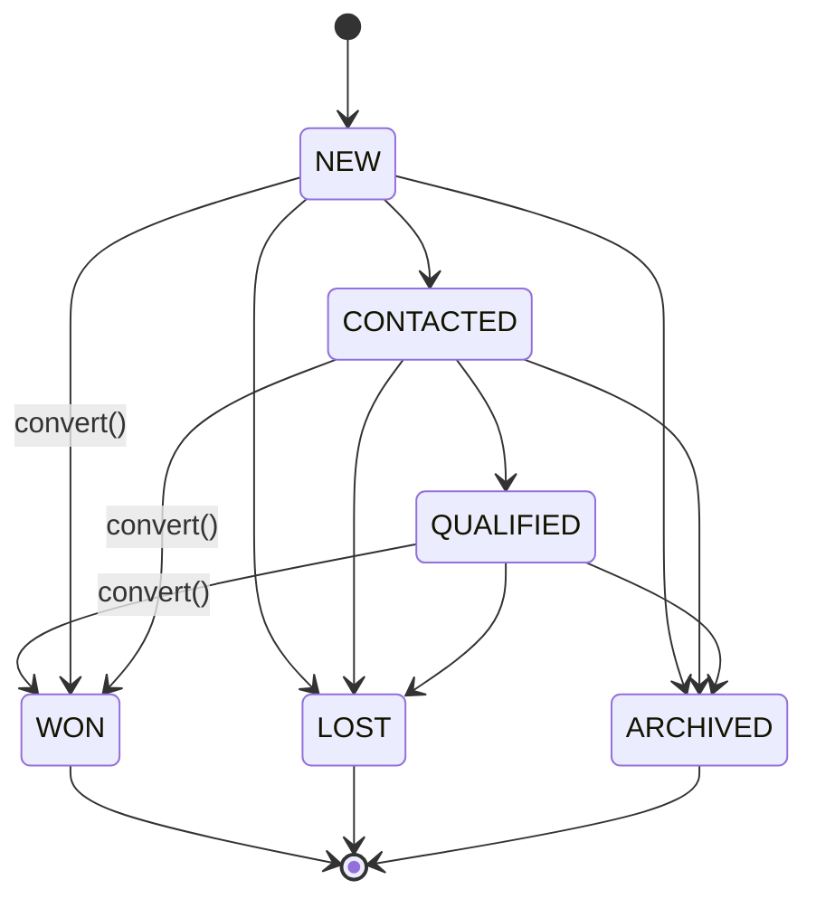

**Side effects**:

- New `Customer` row + `CUST-YYYYMM-####` code (when minting).
- Audit entries.
- The lead's owner becomes eligible for `LEAD_REWARD` commissions on any future sales order linked to this lead (deposit-gated; see Commission flow).

---

## 2. Customer Lifecycle

**Trigger**: `POST/PATCH/DELETE /customers/...`.

**Preconditions**:

- Phone (Thai number) and email — when provided — must be unique among non-soft-deleted customers.
- For `POST`: caller is `ADMIN`, `CS`, `TELESALES`, `BRANCH_MANAGER`, or `SUPER_BRANCH_MANAGER`.
- For mutation: caller is `ADMIN`, `CS`, `BRANCH_MANAGER`, or `SUPER_BRANCH_MANAGER`.
- Branch scoping is enforced for `currentBranchId`.

**Flow**:

1. **Create**: validate uniqueness; mint code via `generateMonthlyCode(tx, 'CUST', 'customer-code')`; persist `Customer`; audit.
2. **Update**: revalidate uniqueness if phone/email changes; audit diff.
3. **Soft-delete** (`DELETE /customers/:id`): sets `deletedAt = now`. Listings/lookups exclude soft-deleted rows.
4. **Change branch** (`POST /customers/:id/change-branch`): validate target branch is `ACTIVE`; update `currentBranchId`; audit `Customer.update` with old/new branch.

**State** (no enum — soft-delete is the only "state"):

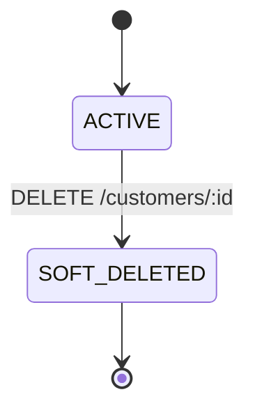

**Side effects**:

- Customers carry monotonic monthly code.
- Wallets are auto-created on first credit (no eager creation here).

---

## 3. Sales Order Lifecycle

**Trigger**: `POST /sales-orders` then `POST /sales-orders/:id/confirm`.

**Preconditions**:

- Branch and customer exist; branch is `ACTIVE`.
- If `leadId` provided: lead.branchId == order.branchId; lead.customerId is null or matches order.customerId.
- Each item references an active, non-deleted `Service` belonging to the same branch.
- `depositRequired ≤ totalAmount`.

**Flow**:

1. **Create** (`SalesOrdersService.create`):
   1. Inside transaction, advisory-lock `sales-order-no`, generate `SO-YYYYMM-####`.
   2. Build totals via `buildTotals(items, taxAmount)`: per item snapshot `serviceCode`, `serviceName`, `unitPrice`, compute `subtotal/discount/total`.
   3. Persist `SalesOrder` (status `DRAFT`) + `SalesOrderItem` rows (with snapshots).
   4. Audit `SalesOrder.create`.
2. **Update** (`PATCH /sales-orders/:id`): only allowed when status is `DRAFT`. Whole-order recompute; replaces items.
3. **Confirm** (`POST /sales-orders/:id/confirm`): `DRAFT → CONFIRMED`. Rejects empty orders.
4. **Cancel** (`POST /sales-orders/:id/cancel`): `DRAFT|CONFIRMED → CANCELLED`. Rejects post-payment.

Subsequent transitions are owned by other modules:

- `CONFIRMED → PARTIALLY_PAID` (`payments.create`)
- `PARTIALLY_PAID → PAID` (`payments.create` when fully paid)
- `→ REFUNDED` set indirectly when refunds reach total paid (modeled by status field; not a controller call).

**State transitions**:

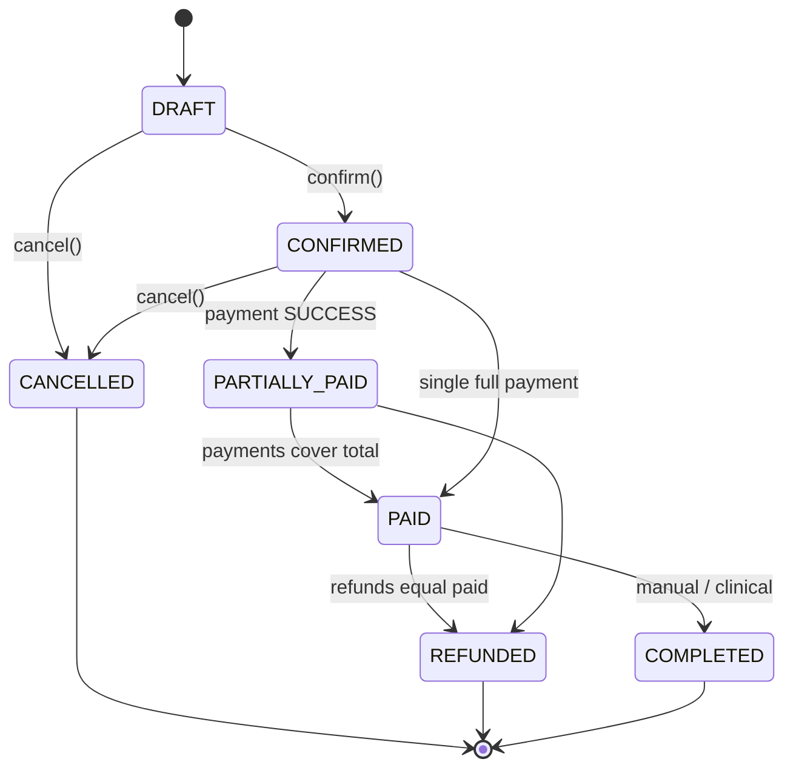

**Side effects**:

- Stamps `confirmedAt`/`cancelledAt`/`completedAt` timestamps.
- `depositSatisfiedAt` is stamped by `payments.create` (not here) when sum of successful payments first hits `depositRequired`.

---

## 4. Payment Lifecycle

**Trigger**: `POST /payments` (`PaymentsService.create`).

**Preconditions**:

- Order is not `CANCELLED`, `COMPLETED`, or `REFUNDED`.
- `existing SUCCESS payments + dto.amount ≤ order.totalAmount`.

**Flow** (single `prisma.$transaction`):

1. Lookup order; sum prior `SUCCESS` payments → `paidSoFar`.
2. Compute `nextStatus` via `computeOrderStatus`:
   - If `paid + amount === total` → `PAID`
   - Else if `paid + amount > 0` → `PARTIALLY_PAID`
   - Else (no-op, can't happen) → keep
3. Determine `shouldStampDeposit = depositSatisfiedAt is null && paidSoFar + amount >= depositRequired`.
4. Determine `shouldMintEntitlements = current status !== PAID && nextStatus === PAID`.
5. Update `SalesOrder` (status, `depositSatisfiedAt` if applicable). Audit.
6. Insert `Payment` (status `SUCCESS`, `paidAt = now`). Audit.
7. If `paymentType === DEPOSIT`: call `wallet.creditWith(tx, { customerId, walletType: DEPOSIT, amount, referenceType: PAYMENT, referenceId: payment.id })`. Wallet auto-created if needed.
8. If `shouldStampDeposit`: call `commissions.evaluateOrderWith(tx, order.id, user.id)`.
9. If `shouldMintEntitlements`: call `entitlements.createForPaidOrderWith(tx, order.id, user.id)`.

**Post-commit (outside the tx)**:

- If `shouldStampDeposit`: emit notification `DEPOSIT_PENDING` (resolution) + `commissions.notifyEligibleForOrder(orderId)`.

**State transitions** (Payment):

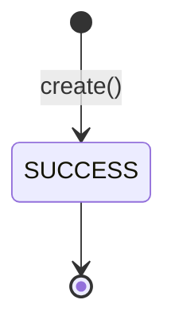

(There is no FAILED/PENDING transition for the synchronous path; failures throw HTTP errors and roll back the tx.)

**Side effects**:

- `WalletTransaction(CREDIT, type=DEPOSIT, referenceType=PAYMENT)` for deposit-type payments.
- `CommissionSnapshot` + `Commission(ELIGIBLE)` rows on the deposit-satisfied trigger.
- `TreatmentEntitlement` rows on first `PAID` (one per program-flagged item, `totalSessions = service.defaultSessions × max(1, quantity)`).
- Audit entries: `SalesOrder.update`, `Payment.create`, plus the embedded audit calls inside wallet/commission/entitlement helpers.
- Notifications.

---

## 5. Inventory — Receiving

**Trigger**: `POST /stock-lots/receive` (`StockLotsService.receive`). Often preceded by `POST /purchase-receipts`.

**Preconditions**:

- Caller is `ADMIN`, `SUPER_BRANCH_MANAGER`, or `CENTRAL_STOCK_HUB`.
- Stock item exists and is active.
- Warehouse exists and is active.
- `(warehouseId, lotCode)` is unique (DB constraint).
- Supplier (if provided) exists; purchase receipt (if provided) exists.

**Flow** (single `prisma.$transaction`):

1. Validate item / warehouse / supplier / receipt.
2. Insert `StockLot` with `status=ACTIVE`, `quantityOnHand = quantityReceived`, `unitCost`, optional `manufacturedAt`, `expiresAt`.
3. Insert `StockMovement(type=PURCHASE_IN, qtyDelta = +quantityReceived)`.
4. Audit `StockLot.create`.

**State transitions** (StockLot):

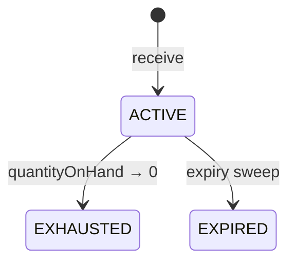

**Side effects**:

- New active lot, FEFO-orderable via `expiresAt asc nulls last`.
- New movement row in the inventory ledger.

---

## 6. Inventory — Transfer

**Trigger**: lifecycle endpoints on `/stock-transfers/:id`. Initial `POST /stock-transfers` creates a `DRAFT`.

**Preconditions**:

- Source warehouse and destination warehouse exist; both branches active.
- Caller has the required role per stage (request/approve/dispatch/receive/cancel — see role matrix).
- Each item references a real source lot in the source warehouse.

**Flow**:

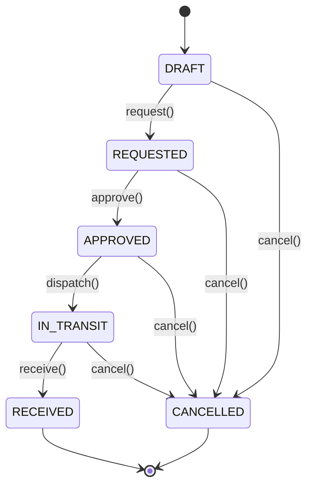

**Dispatch** (`POST /stock-transfers/:id/dispatch`, single tx):

1. Aggregate `quantitySent` per source lot.
2. For each source lot: `SELECT id FROM stock_lots WHERE id = ${lotId} FOR UPDATE` (row lock).
3. Decrement `quantityOnHand`; mark `EXHAUSTED` if zero.
4. Stamp `quantitySent` per item; insert `StockMovement(TRANSFER_OUT, -qtyDelta)` per item.
5. Set transfer status `IN_TRANSIT`.

**Receive** (`POST /stock-transfers/:id/receive`, single tx):

1. For each item: mint a destination `StockLot` (unique-ified `lotCode` via `uniqueLotCodeForWarehouse`), parent-linked via `parentStockLotId`, copy supplier/receipt/manufacturedAt/expiresAt/unitCost.
2. Insert `StockMovement(TRANSFER_IN, +quantityReceived)` per item.
3. Stamp `quantityReceived` and `toStockLotId` on the item.
4. Set transfer status `RECEIVED`.

**Side effects**:

- Atomic ledger preservation: `Σ TRANSFER_OUT (negative) + Σ TRANSFER_IN (positive) = 0` for each transfer.
- Post-commit notification (`STOCK_TRANSFER_RECEIVED`) to receiving branch managers + central hub, dedup'd by `transferId`.

---

## 7. Inventory — Stock Consumption (Clinical Usage)

There are two paths into the clinical-consumption ledger: **direct lot consume** and **opened container use**.

### 7a. Direct lot consume — `POST /service-events/:id/consume-stock` (`ServiceEventsService.consumeStock`)

**Preconditions**:

- Service event exists, is `IN_PROGRESS`, branch matches caller scope.
- Stock lot exists, status `ACTIVE`, not expired.
- Stock item's `consumptionStrategy` allows the path:
  - `WHOLE_ONLY`: `quantity` must be an integer.
  - `PARTIAL_REQUIRED`: must use `openedContainerId` (rejected here unless wired separately).

**Flow** (single tx):

1. `SELECT id FROM stock_lots WHERE id = ${lotId} FOR UPDATE`.
2. Re-validate lot is `ACTIVE`, not expired, has `quantityOnHand >= dto.quantity`.
3. Decrement `quantityOnHand`; mark `EXHAUSTED` if zero.
4. Insert `StockMovement(CLINICAL_USAGE, -qtyDelta)` referencing event + lot.
5. Insert `ServiceStockUsage(serviceEventId, stockItemId, stockLotId, primaryQty, …)`.
6. Audit `CustomerServiceEvent.update`.

### 7b. Opened container — `POST /opened-containers/:id/use` (`OpenedContainersService.use`)

**Preconditions**:

- Container is `ACTIVE`, not expired, matches `serviceId`.
- Service event is `IN_PROGRESS`.
- `dto.quantity ≤ remainingQtyPrimary`.

**Flow** (single tx):

1. `SELECT id FROM opened_containers WHERE id = ${id} FOR UPDATE`.
2. Decrement `remainingQtyPrimary`; if `≤ 0`, set status `EMPTY`.
3. Insert `ServiceStockUsage` referencing the container.
4. Audit `OpenedContainer.update`.

**Side effects (both paths)**:

- Inventory ledger now records a `CLINICAL_USAGE` movement (or container use) tied to the service event.
- Once all events on an appointment are `COMPLETED`, the appointment auto-completes (see Clinical Execution).

---

## 8. Appointment Scheduling

**Trigger**: `POST /appointments` (`AppointmentsService.create`).

**Preconditions**:

- Sales order is not `CANCELLED` or `REFUNDED`.
- Customer matches `salesOrder.customerId`.
- Service is on the order's items.
- Doctor (if provided) is `ACTIVE`.
- If `entitlementId` provided: matches customer + service, has remaining sessions, not expired (`entitlements.assertBookable`).

**Flow** (single tx):

1. Validate.
2. Inside tx: advisory-lock `appointment-no:${YYYYMMDD}`, generate `APT-YYYYMMDD-####`.
3. Insert `Appointment` (status `BOOKED`, `scheduledAt`, `entitlementId`, `entitlementConsumedAt = null`).
4. Audit `Appointment.create`.

**State transitions**:

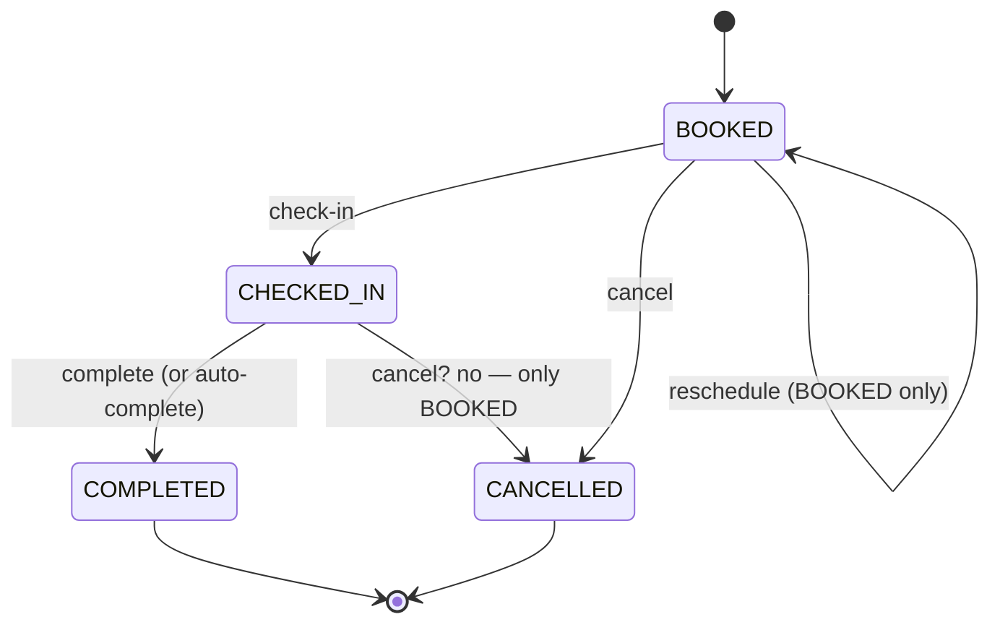

**Side effects**:

- Post-commit notification (`APPOINTMENT_REMINDER`) to assigned doctor (dedup'd), iff `dto.doctorUserId` is set.
- The 30-minute cron rule `APPOINTMENT_REMINDER` later renotifies if the appointment is within `APPOINTMENT_REMINDER_WINDOW_HOURS` (24h default) and not yet processed for that hour bucket.

---

## 9. Clinical Execution

**Trigger sequence**: `PATCH /appointments/:id/check-in` → `POST /service-events` → `POST /service-events/:id/consume-stock` (or `…/stock-usage`) → `PATCH /service-events/:id/complete`.

**Preconditions**:

- Appointment must be `CHECKED_IN` before any `service-events` create with `appointmentId` (or walk-in path with no appointment id).
- Service must match.

**Flow**:

1. Operator checks the customer in (`BOOKED → CHECKED_IN`).
2. Operator opens one or more `CustomerServiceEvent` rows (`POST /service-events`). Linked to appointment + sales order; customer/service/branch are validated to match the appointment.
3. Each event consumes stock zero or more times via direct lot consume or opened container use (see workflow #7).
4. Operator completes each event via `PATCH /service-events/:id/complete` — status flips `IN_PROGRESS → COMPLETED`, audit recorded.
5. **Auto-complete**: the completion step checks every `CustomerServiceEvent` linked to the parent appointment; if all are `COMPLETED` and the appointment is `CHECKED_IN`, the appointment is updated to `COMPLETED` in the same tx (audit shows `autoCompletedBy: 'service-events'`).
6. Manual completion via `PATCH /appointments/:id/complete` runs `entitlements.tryConsumeAppointmentWith(tx, …)` if the appointment has an `entitlementId` and `entitlementConsumedAt = null`. The drawdown is **idempotent**: first stamp `entitlementConsumedAt`, then atomic `UPDATE … SET consumedSessions = consumedSessions + 1 WHERE consumedSessions < totalSessions AND (expiredAt IS NULL OR expiredAt > NOW())`. Race losers throw `Conflict`.

**State transitions** (CustomerServiceEvent):

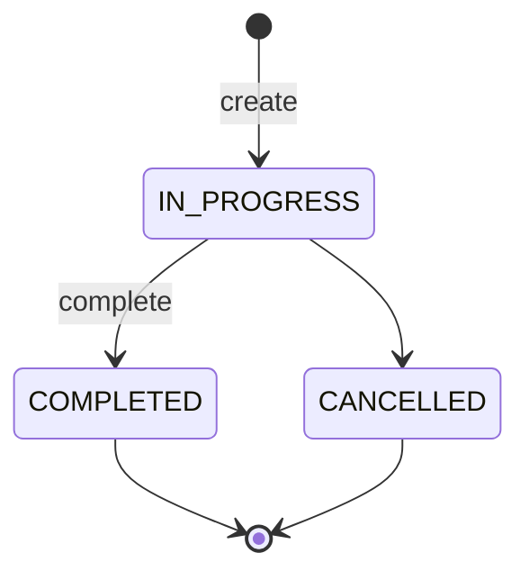

**Side effects**:

- `ServiceStockUsage` rows + `StockMovement(CLINICAL_USAGE)` for each consumption.
- Appointment auto-completion when its events all complete (with optional entitlement drawdown).
- `TreatmentEntitlement.consumedSessions` increments by 1; `Appointment.entitlementConsumedAt` stamped.

---

## 10. Commission Calculation

**Trigger**:

- Implicit: `payments.create` on the deposit-satisfied transition calls `commissions.evaluateOrderWith(tx, salesOrderId, actorUserId)`.
- Explicit: `POST /commissions/evaluate/:salesOrderId`.

**Preconditions**:

- Sales order exists.
- For `LEAD_REWARD`: `lead.currentOwnerUserId != null` and `salesOrder.depositSatisfiedAt != null`.
- For `SALES_COMMISSION`: at least one `Appointment` or `CustomerServiceEvent` exists for the order.

**Flow** (`evaluateOrderWith`, runs inside parent tx):

1. Load order with `items.service.commissionGroupCode`, `branch`, `lead.currentOwner`, `createdBy`.
2. Bucket items by `ServiceGroupCode` (sums `netAmount` per group).
3. Compute `appointmentBookedOrEvent = (appt count + event count) > 0`.
4. Read existing `CommissionSnapshot` rows keyed `(salesOrderId, serviceGroupCode, commissionType)` for dedup.
5. For each `(group, type) ∈ {LEAD_REWARD, SALES_COMMISSION} × buckets`:
   - Skip if snapshot already exists for `(group, type)`.
   - Eligibility check.
   - Resolve `recipientUserId` (`lead.currentOwnerUserId` for LEAD_REWARD, `order.createdByUserId` for SALES_COMMISSION).
   - Filter active `CommissionRule` rows by `(branchId, serviceGroupCode, commissionType, isActive=true)`.
   - `pickHighestMatchingTier(rules, subtotal)`: choose the rule with the largest `minAmount ≤ subtotal`.
   - Compute payout: `FIXED → value`; `PERCENTAGE → subtotal × value` (rounded to 2dp).
   - Insert `CommissionSnapshot` (freezing branch name, recipient role, sale creator name, lead-owner name, service name, tier rule, value).
   - Insert `Commission(status=ELIGIBLE, ruleId, ruleType, valueType, value, snapshotId, salesOrderId, recipientUserId, createdByUserId, computedAmount)`.
   - Audit `Commission.create` with op `evaluate`.
6. Return list of eligible commissions.

**Lifecycle** (`POST /commissions/:id/lock`, `POST /commissions/:id/pay`):

- `lock`: `ELIGIBLE → LOCKED`, stamp `lockedAt`, `lockedByUserId`. Audit.
- `pay`: `LOCKED → PAID`, stamp `paidAt`, `paidByUserId`. Audit. Post-commit notification `COMMISSION_PAID` to recipient (dedup'd).

**Revocation** (`refunds.complete` calls `commissions.revokeForOrderWith(tx, salesOrderId, refundId, reason)`):

- All `Commission` rows for that order with `status != PAID` flip to `REVOKED` (`revokedAt`, `revokedByRefundId`, `revokedReason`). Audit each.

**State transitions**:

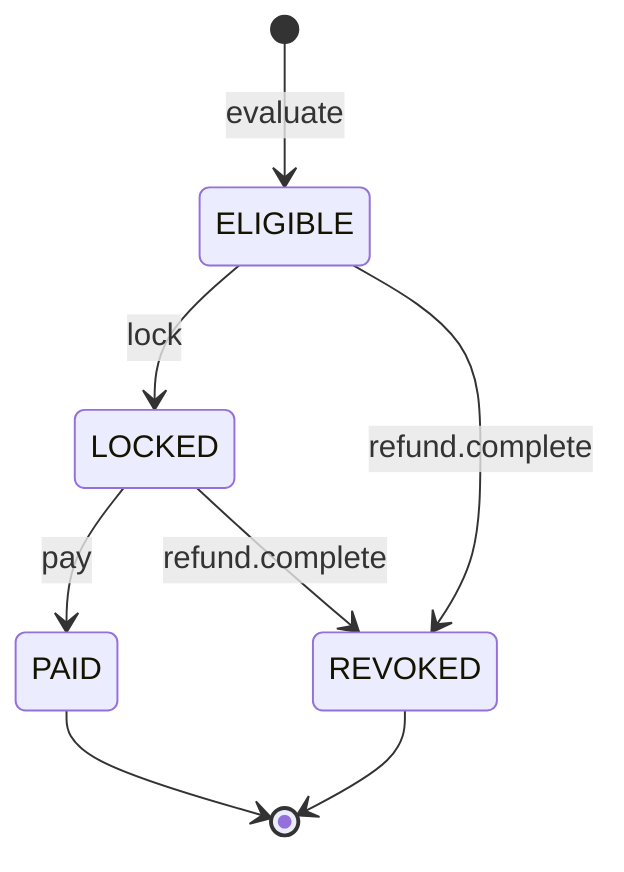

**Side effects**:

- `CommissionSnapshot` (immutable freeze of context).
- `Commission` row(s).
- Post-commit `COMMISSION_ELIGIBLE` and `COMMISSION_PAID` notifications.
- Optional revocation through refunds.

---

## 11. Refund Handling

**Trigger**: `POST /refunds` with subsequent `approve`/`reject`/`complete`.

**Preconditions** (create):

- Sales order exists and has at least one `SUCCESS` payment.
- `dto.amount ≤ Σ SUCCESS payments − Σ refunds in {REQUESTED, APPROVED, COMPLETED}`.

**Flow**:

1. **Create** (`RefundsService.create`, single tx):
   1. Validate amount.
   2. Advisory-lock `refund-no:${YYYYMMDD}`, generate `RFD-YYYYMMDD-####`.
   3. Insert `Refund(status=REQUESTED, amount, refundType, reason, requesterUserId, salesOrderId, customerId)`.
   4. Audit `Refund.create`.
   5. Post-commit: notify branch managers + admin/super (`REFUND_REQUEST` dedup `REFUND_REQUEST|refundId|YYYY-MM-DD`).
2. **Approve** (`POST /refunds/:id/approve`): `REQUESTED → APPROVED`, stamp `approvedByUserId`, `approvedAt`.
3. **Reject** (`POST /refunds/:id/reject`): `REQUESTED → REJECTED`. (Terminal.)
4. **Complete** (`POST /refunds/:id/complete`, single tx):
   1. `APPROVED → COMPLETED`, stamp `completedAt`.
   2. `commissions.revokeForOrderWith(tx, salesOrderId, refund.id, reason)` flips non-PAID commissions to `REVOKED`.
   3. If `refund.creditToWallet === true` (default): `wallet.creditWith(tx, { customerId, walletType: DEPOSIT, amount, referenceType: REFUND, referenceId: refund.id })`.
   4. Audit `Refund.update` with the list of revoked commission IDs and wallet txn id (when posted).
5. Post-commit: notify requester (`REFUND_APPROVED` dedup `REFUND_COMPLETED|refundId`).

**State transitions**:

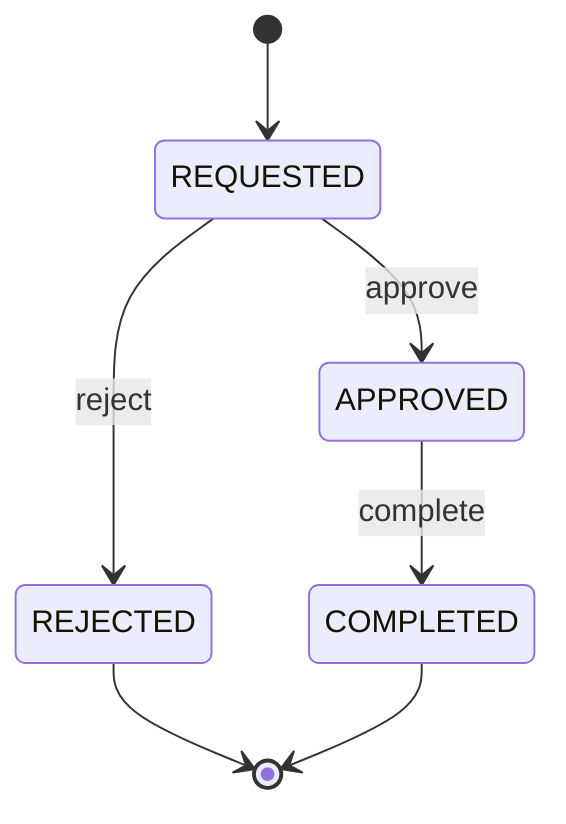

**Side effects**:

- `Commission` revocation.
- Optional `WalletTransaction(CREDIT, type=REFUND, referenceType=REFUND, referenceId=refund.id)` on completion.
- Notifications.

---

## 12. Notification Automation

Notifications come from two sources, both backed by the same `Notification` table with a unique `dedupeKey`.

### 12a. Inline (event-driven) hooks

These fire **post-commit** from inside service methods:

| Source | Trigger | Type | Recipients | Dedup key |
|---|---|---|---|---|
| `payments.create` | deposit-satisfied transition | `PAYMENT_REMINDER` (resolution) | sales creator | `DEPOSIT_SATISFIED|orderId` |
| `payments.create` | deposit-satisfied transition | `COMMISSION_ELIGIBLE` (per commission row) | recipientUserId | `COMMISSION_ELIGIBLE|commissionId|recipientUserId` |
| `appointments.create` | booking with doctor | `APPOINTMENT_REMINDER` | doctorUserId | `APPOINTMENT_CREATE|appointmentId|doctorUserId` |
| `commissions.pay` | LOCKED → PAID | `COMMISSION_ELIGIBLE` (paid variant) | recipientUserId | `COMMISSION_PAID|commissionId` |
| `refunds.create` | REQUESTED | `REFUND_REQUEST` | branch managers | `REFUND_REQUEST|refundId|YYYY-MM-DD` |
| `refunds.complete` | COMPLETED | `REFUND_REQUEST` (resolution) | requesterUserId | `REFUND_COMPLETED|refundId` |
| `inventory/stock-transfers.receive` | RECEIVED | `STOCK_TRANSFER` | receiving branch managers + central hub | `STOCK_TRANSFER_RECEIVED|transferId|userId` |

### 12b. Cron rules (`AutomationService.runScheduled`)

| Rule code | Schedule (cron) | Source | Recipients | Dedup key |
|---|---|---|---|---|
| `DEPOSIT_PENDING` | `0 * * * *` (hourly) | sales orders with unpaid deposit | sales creator + branch managers | `DEPOSIT_PENDING|orderId|YYYY-MM-DD` |
| `APPOINTMENT_REMINDER` | `*/30 * * * *` | `BOOKED` appts within `APPOINTMENT_REMINDER_WINDOW_HOURS` | doctor + creator | `APPOINTMENT_REMINDER|appointmentId|YYYYMMDDHH` |
| `LOW_STOCK` | `0 */2 * * *` | groupBy lots ≤ `LOW_STOCK_THRESHOLD` | branch managers + central hub | `LOW_STOCK|wId|sId|YYYY-MM-DD` |
| `EXPIRING_STOCK` | `0 8 * * *` (daily) | active lots, expiry within `EXPIRY_ALERT_DAYS` | branch managers + central hub | `EXPIRING_STOCK|lotId|YYYY-MM-DD` |
| `REFUND_APPROVAL` | `*/15 * * * *` | refunds in `REQUESTED` | branch managers | `REFUND_REQUEST|refundId|YYYY-MM-DD` |
| `COMMISSION_ELIGIBLE` | `0 * * * *` | commissions in `ELIGIBLE` | recipientUserId | `COMMISSION_ELIGIBLE|commissionId|recipientUserId` |
| `WALLET_EXPIRY` | `0 9 * * *` (daily) | wallet credits whose `metadata.expiresAt` falls within `WALLET_EXPIRY_NOTICE_DAYS` | branch managers (of customer) | `WALLET_EXPIRY|txId|YYYY-MM-DD` |
| `LEAD_FOLLOWUP` | `0 */4 * * *` | leads in `CONTACTED` older than `LEAD_FOLLOWUP_HOURS` | current owner | `LEAD_FOLLOWUP|leadId|ownerId|YYYY-MM-DD` |

A separate cron (`ExpirySweepService.runScheduled`, daily 03:00) auto-expires past-due lots and opened containers, writing `EXPIRE` movements where applicable.

**Flow** (every notification path):

1. Build `Notification` rows with `dedupeKey`.
2. `notifyMany(userIds, base)` invokes `prisma.notification.create`. On `P2002` (unique violation on `dedupeKey`) the existing row is returned and `created: false` is reported (idempotent).
3. `dispatch(notification)` — fire-and-forget per channel (`InAppProvider`, `EmailProvider` stub, `SmsProvider` stub). Failures are logged, not thrown.
4. Workers can re-dispatch via `dispatchById(id)` (`workers.ts` notification queue consumer).

**State transitions** (Notification):

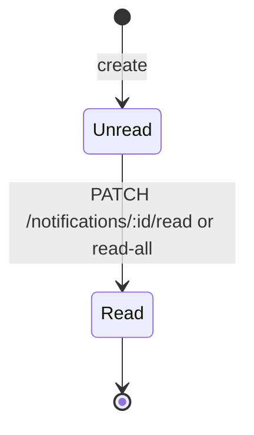

**Side effects**:

- `Notification` rows for in-app delivery.
- (Email/SMS providers are stubs that log only.)

---

## 13. Branch Stock Sale (Walk-in Retail) Lifecycle

(Not in the original list, but adjacent to Sales Orders and worth referencing.)

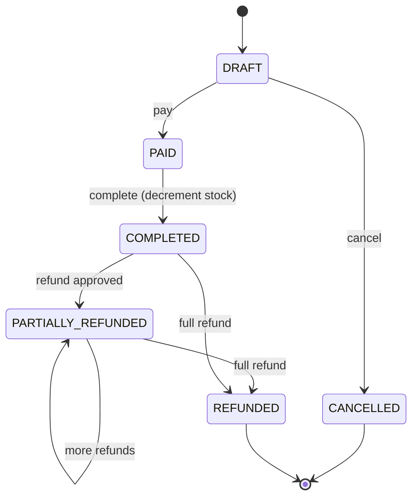

- **FEFO allocation** at `create()` — items expanded across active lots in the BRANCH-typed warehouse, ordered by `expiresAt asc`.
- Stock decrement happens on `complete()` (not `create()`).
- `refund` is a request → approve workflow distinct from sales-order refunds.

---

## 14. Branch Quarterly Targets

**Trigger**: `POST /targets`, `PATCH /targets/:id`. Read via `GET /targets/branch/:branchId/progress`.

**Preconditions**:

- Branch is `ACTIVE`.
- `categories` is non-empty; each `commissionGroup` is unique within the target.
- `Σ categories[*].targetAmount === totalTarget` (±0.01 tolerance).
- `(branchId, year, quarter)` unique (DB constraint surfaces `409 Conflict`).

**Progress computation** (`TargetProgressService.getQuarterProgress`):

1. `assertBranchAccess(user, branchId)`.
2. Resolve `[start, end)` for the quarter.
3. `Promise.all([branchQuarterTarget.findUnique(branchId,year,quarter), $queryRaw aggregate])`.
4. Raw SQL groups `SUM(SalesOrderItem.netAmount)` by `Service.commissionGroupCode` for orders with `status=COMPLETED` and `completedAt` in `[start, end)`.
5. `assembleQuarterProgress(args)` joins target categories with actuals; computes `progressPercent = round1(actual/target × 100)` per category, plus overall.

**Side effects**:

- Pure read; no writes (`audit` only on create/update).
- Returned shape: `{ branch, year, quarter, totalTarget, totalActual, overallProgress, categories: [{ commissionGroup, target, actual, progress }] }`.

---

## Summary of Cross-Module Triggers

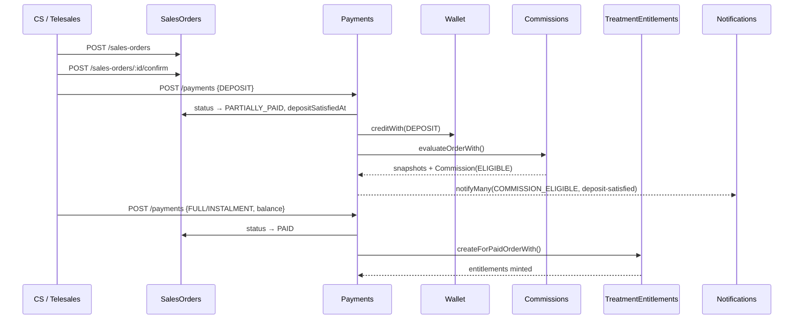

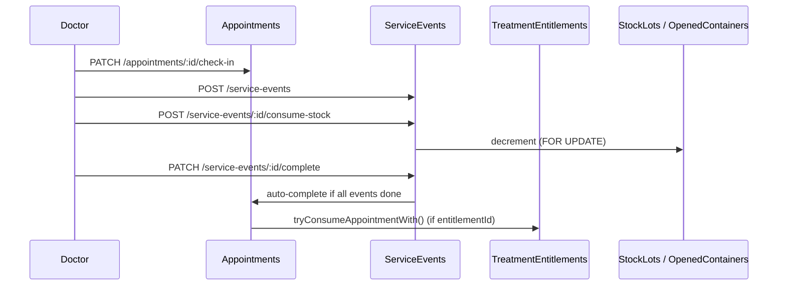

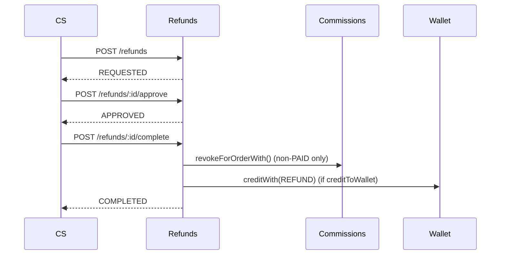
