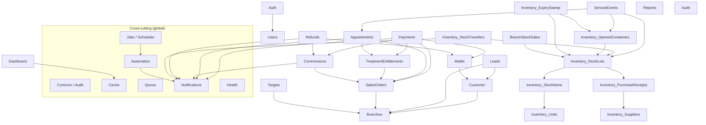
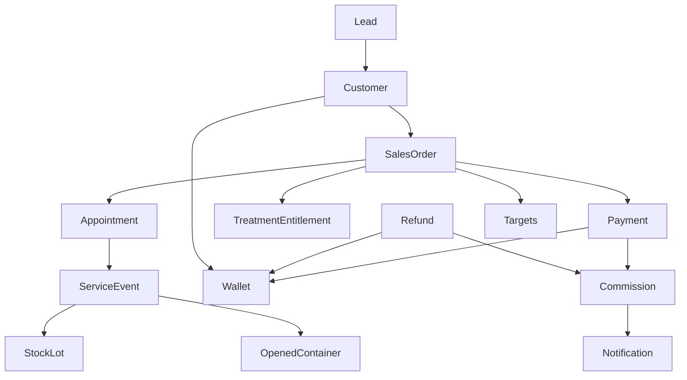

# Reverie Desk — Module Map

All routes are mounted at `/api/v1/...` unless noted (`/health/*` is `VERSION_NEUTRAL`, `/api/docs` serves Swagger). Module folders live under `src/`.

## Top-level Dependency Graph

## Pipeline View (CRM → Cash)

---

## Module Reference

For each module: **Path**, **Purpose**, **Main entities**, **Exposed APIs**, **Depends on**, **Used by**.

### `auth`

- **Path**: `src/auth/`
- **Purpose**: Issue and validate JWTs; authenticate by email + password.
- **Main entities**: `User`, `Role`, `Permission` (read), `UserRole`, `RolePermission` (read).
- **APIs**:
  - `POST /auth/login` (rate-limited 5/min)
  - `GET /auth/me`
- **Depends on**: `users`, `@nestjs/jwt`, `@nestjs/passport`.
- **Used by**: every other module via `JwtAuthGuard`.

### `users`

- **Path**: `src/users/`
- **Purpose**: User CRUD + branch assignment + role/permission resolution.
- **Main entities**: `User`, `UserRole`.
- **APIs**:
  - `POST /users`, `GET /users`, `GET /users/by-branch/:branchId`, `GET /users/:id`
  - `PATCH /users/:id`
  - `PATCH /users/:id/assign-branch`, `PATCH /users/:id/unassign-branch`
- **Depends on**: `prisma`, `bcrypt`, `common/audit`.
- **Used by**: `auth`, every guard, `automation/recipients.service.ts`.

### `branches`

- **Path**: `src/branches/`
- **Purpose**: Branch directory; status (`ACTIVE`/`INACTIVE`); deactivation safety checks.
- **Main entities**: `Branch`.
- **APIs**: `POST /branches`, `GET /branches`, `GET /branches/:id`, `PATCH /branches/:id`, `PATCH /branches/:id/activate`, `PATCH /branches/:id/deactivate`.
- **Depends on**: `prisma`, `common/audit`.
- **Used by**: `customer`, `leads`, `sales-orders`, `appointments`, `service-events`, `branch-stock-sales`, `targets`, `inventory/*`.

### `customer` (singular path, plural URL)

- **Path**: `src/customer/`
- **Purpose**: Customer CRUD; soft delete; branch reassignment; concurrency-safe `CUST-YYYYMM-####` codes.
- **Main entities**: `Customer`.
- **APIs**: `POST /customers`, `GET /customers`, `GET /customers/:id`, `PATCH /customers/:id`, `DELETE /customers/:id`, `POST /customers/:id/change-branch`.
- **Depends on**: `prisma`, `common/audit`, `branches` (`validateBranchActive`).
- **Used by**: `leads` (conversion), `sales-orders`, `appointments`, `service-events`, `wallet`, `branch-stock-sales`.

### `leads`

- **Path**: `src/leads/`
- **Purpose**: Lead pipeline; owner reassignment + ownership log; interaction history; convert qualified leads to customers.
- **Main entities**: `Lead`, `LeadOwnerLog`, `LeadInteraction`.
- **APIs**: `POST /leads`, `GET /leads`, `GET /leads/:id`, `GET /leads/:id/interactions`, `POST /leads/:id/interactions`, `POST /leads/:id/assign`, `PATCH /leads/:id/status`, `PATCH /leads/interactions/:id`, `DELETE /leads/interactions/:id`, `POST /leads/:id/convert`.
- **State**: `LeadStatus = NEW → CONTACTED → FOLLOW_UP → QUALIFIED`; `QUALIFIED → LOST`; `QUALIFIED → WON` only via `convert()`; `WON/LOST → ARCHIVED`. Admins may archive **expired** leads from any status via `PATCH /leads/:id/status`.
- **Depends on**: `prisma`, `common/audit`, `customer` (`generateMonthlyCode`), `branches`.
- **Used by**: `sales-orders` (optional `leadId`), `commissions` (`LEAD_REWARD` recipient).

### `sales-orders`

- **Path**: `src/sales-orders/`
- **Purpose**: Service sales lifecycle (no inventory deduction here — see Branch Stock Sales for retail goods).
- **Main entities**: `SalesOrder`, `SalesOrderItem`.
- **APIs**: `POST /sales-orders`, `GET /sales-orders`, `GET /sales-orders/:id`, `PATCH /sales-orders/:id` (DRAFT only), `POST /sales-orders/:id/confirm`, `POST /sales-orders/:id/cancel`.
- **State**: `DRAFT → CONFIRMED → CANCELLED`; status flips to `PARTIALLY_PAID` / `PAID` / `COMPLETED` / `REFUNDED` are owned by other modules.
- **Depends on**: `prisma`, `common/audit`, `branches`.
- **Used by**: `payments`, `appointments`, `service-events`, `commissions`, `refunds`, `treatment-entitlements`, `targets`.

### `payments`

- **Path**: `src/payments/`
- **Purpose**: Apply payments to a sales order; advance status; trigger commissions, entitlements, and wallet credits.
- **Main entities**: `Payment`, `WalletTransaction` (created via wallet service).
- **APIs**: `POST /payments`, `GET /payments`, `GET /payments/:id`.
- **Depends on**: `sales-orders`, `wallet` (global), `commissions` (global), `treatment-entitlements`, `notifications` (global).
- **Used by**: `refunds` (validates against successful payments).

### `appointments`

- **Path**: `src/appointments/`
- **Purpose**: Booking, check-in, completion, cancellation, reschedule.
- **Main entities**: `Appointment`.
- **APIs**: `POST /appointments`, `GET /appointments`, `GET /appointments/:id`, `PATCH /appointments/:id/check-in`, `PATCH /appointments/:id/complete`, `PATCH /appointments/:id/cancel`, `PATCH /appointments/:id/reschedule`.
- **State**: `BOOKED → {CHECKED_IN, CANCELLED}`, `CHECKED_IN → COMPLETED`.
- **Depends on**: `sales-orders`, `treatment-entitlements`, `notifications` (global).
- **Used by**: `service-events`, `commissions` (eligibility), `dashboard` (KPIs), `automation/appointment-reminder`.

### `service-events`

- **Path**: `src/service-events/`
- **Purpose**: Record clinical service execution; consume stock; auto-complete the parent appointment.
- **Main entities**: `CustomerServiceEvent`, `ServiceStockUsage`, `StockMovement` (writes).
- **APIs**: `POST /service-events`, `GET /service-events`, `GET /service-events/customer/:customerId`, `GET /service-events/:id`, `POST /service-events/:id/consume-stock` (alias `…/stock-usage`), `PATCH /service-events/:id/complete`.
- **State**: `IN_PROGRESS → {COMPLETED, CANCELLED}`.
- **Depends on**: `appointments` (linkage), `inventory/stock-lots` (lock + decrement), `inventory/opened-containers` (alternate path).
- **Used by**: `commissions` (eligibility includes any service event for the order), `reports`, `dashboard`.

### `treatment-entitlements`

- **Path**: `src/treatment-entitlements/`
- **Purpose**: Track session-based program redemptions (e.g., 7-session hair growth).
- **Main entities**: `TreatmentEntitlement` (1:1 with `SalesOrderItem`).
- **APIs**: `GET /customers/:id/entitlements`, `GET /entitlements/:id`, `POST /appointments/:id/consume`, `PATCH /entitlements/:id/expire`.
- **Internal helpers**: `createForPaidOrderWith(tx, …)`, `assertBookable(tx, …)`, `tryConsumeAppointmentWith(tx, …)`.
- **Depends on**: `sales-orders` (`Service.isProgram`, `defaultSessions`).
- **Used by**: `payments` (mint on first PAID), `appointments` (bookability + drawdown).

### `commissions` (global)

- **Path**: `src/commissions/`
- **Purpose**: Tier-based commission calculation by `(branch, ServiceGroupCode)`; lifecycle `ELIGIBLE → LOCKED → PAID` plus `REVOKED`.
- **Main entities**: `CommissionRule`, `CommissionSnapshot`, `Commission`.
- **APIs**:
  - Engine: `POST /commissions/evaluate/:salesOrderId`, `GET /commissions`, `GET /commissions/:id`, `POST /commissions/:id/lock`, `POST /commissions/:id/pay`.
  - Admin: `GET /commission-rules`, `POST /commission-rules`, `PATCH /commission-rules/:id`, `DELETE /commission-rules/:id` (soft), `POST /commission-rules/bulk-upsert`, `POST /commission-rules/calculate`.
- **Depends on**: `sales-orders`, `notifications` (global).
- **Used by**: `payments` (`evaluateOrderWith`), `refunds` (`revokeForOrderWith`), `dashboard`, `reports`, `automation/commission-eligible`.

### `refunds`

- **Path**: `src/refunds/`
- **Purpose**: Refund lifecycle and money-flow side effects.
- **Main entities**: `Refund`.
- **APIs**: `POST /refunds`, `GET /refunds`, `GET /refunds/:id`, `POST /refunds/:id/approve`, `POST /refunds/:id/reject`, `POST /refunds/:id/complete`.
- **State**: `REQUESTED → {APPROVED, REJECTED}`, `APPROVED → COMPLETED`.
- **Depends on**: `commissions` (global), `wallet` (global), `notifications` (global).
- **Used by**: `dashboard`, `reports`, `automation/refund-approval`.

### `wallet` (global)

- **Path**: `src/wallet/`
- **Purpose**: Customer wallets (one per `WalletType`); concurrency-safe credit / debit / transfer.
- **Main entities**: `Wallet`, `WalletTransaction`.
- **APIs**: `GET /wallet/customer/:customerId`, `POST /wallet/credit`, `POST /wallet/debit`, `POST /wallet/transfer`.
- **Depends on**: `customer`.
- **Used by**: `payments` (`creditWith` for `DEPOSIT` payments), `refunds` (`creditWith` for refund completion), `automation/wallet-expiry`.

### `inventory/units`

- **Path**: `src/inventory/units/`
- **APIs**: `POST/GET/GET:id/PATCH:id/DELETE:id /units`.
- **Main entities**: `Unit`.
- **Used by**: `inventory/stock-items`.

### `inventory/suppliers`

- **Path**: `src/inventory/suppliers/`
- **APIs**: `POST/GET/GET:id/PATCH:id /suppliers`.
- **Main entities**: `Supplier`.
- **Used by**: `inventory/purchase-receipts`, `inventory/stock-lots`.

### `inventory/stock-items`

- **Path**: `src/inventory/stock-items/`
- **APIs**: `POST/GET/GET:id/PATCH:id/DELETE:id /stock-items`.
- **Main entities**: `StockItem`.
- **Depends on**: `inventory/units`.
- **Used by**: `inventory/stock-lots`, `inventory/opened-containers`, `branch-stock-sales`, `service-events`.

### `inventory/purchase-receipts`

- **Path**: `src/inventory/purchase-receipts/`
- **APIs**: `POST /purchase-receipts`, `GET /purchase-receipts`, `GET /purchase-receipts/:id`.
- **Main entities**: `PurchaseReceipt`.
- **Used by**: `inventory/stock-lots` (`receive()`).

### `inventory/stock-lots`

- **Path**: `src/inventory/stock-lots/`
- **APIs**: `POST /stock-lots/receive`, `GET /stock-lots`, `GET /stock-lots/expiring`, `GET /stock-lots/:id`.
- **Main entities**: `StockLot`, `StockMovement` (writes `PURCHASE_IN`).
- **Depends on**: `inventory/stock-items`, `inventory/suppliers`, `inventory/purchase-receipts`, `branches` (warehouse → branch).
- **Used by**: `inventory/stock-transfers`, `inventory/opened-containers`, `service-events`, `branch-stock-sales`, `inventory/expiry-sweep`.

### `inventory/stock-transfers`

- **Path**: `src/inventory/stock-transfers/`
- **APIs**: `POST /stock-transfers`, `GET /stock-transfers`, `GET /stock-transfers/:id`, `PATCH /stock-transfers/:id/request`, `PATCH /stock-transfers/:id/approve`, `POST /stock-transfers/:id/dispatch`, `POST /stock-transfers/:id/receive`, `PATCH /stock-transfers/:id/cancel`.
- **Main entities**: `StockTransfer`, `StockTransferItem`, `StockMovement` (writes `TRANSFER_OUT`/`TRANSFER_IN`).
- **State**: `DRAFT → REQUESTED → APPROVED → IN_TRANSIT → RECEIVED`; `CANCELLED` from any non-terminal.
- **Depends on**: `inventory/stock-lots`, `notifications` (global).
- **Used by**: `dashboard`, `reports`.

### `inventory/opened-containers`

- **Path**: `src/inventory/opened-containers/`
- **APIs**: `POST /opened-containers` (and `…/open`), `POST /opened-containers/:id/use`, `PATCH /opened-containers/:id/discard`, `PATCH /opened-containers/:id/expire`, `GET /opened-containers`, `GET /opened-containers/:id`.
- **Main entities**: `OpenedContainer`, `ServiceStockUsage` (on `use()`).
- **State**: `ACTIVE → {EMPTY, DISCARDED, EXPIRED}`.
- **Depends on**: `inventory/stock-lots`, `service-events`.
- **Used by**: `service-events` (multi-use products), `inventory/expiry-sweep`.

### `inventory/expiry-sweep`

- **Path**: `src/inventory/expiry-sweep/`
- **APIs**: `POST /admin/expiry-sweep/run`.
- **Cron**: daily 03:00.
- **Depends on**: `inventory/stock-lots`, `inventory/opened-containers`, `common/audit`.

### `branch-stock-sales`

- **Path**: `src/sales/branch-stock-sales/`
- **Purpose**: Walk-in retail sales of stock items at a branch.
- **Main entities**: `BranchStockSale`, `BranchStockSaleItem`, `BranchStockSaleRefund`, `StockMovement` (`RETAIL_SALE`).
- **APIs**: `POST /branch-stock-sales`, `GET /branch-stock-sales`, `GET /branch-stock-sales/:id`, `PATCH …/pay`, `PATCH …/complete`, `PATCH …/cancel`, `POST …/refund`, `PATCH /branch-stock-sales/refunds/:id/approve`.
- **State**: `DRAFT → {PAID, CANCELLED}`, `PAID → COMPLETED`, `COMPLETED → {PARTIALLY_REFUNDED, REFUNDED}`.
- **Depends on**: `inventory/stock-lots` (FEFO + lock + decrement on complete).

### `targets`

- **Path**: `src/targets/`
- **APIs**: `POST /targets`, `PATCH /targets/:id`, `GET /targets/branch/:branchId?year&quarter`, `GET /targets/branch/:branchId/progress?year&quarter`.
- **Main entities**: `BranchQuarterTarget`, `BranchQuarterTargetCategory`.
- **Depends on**: `branches`, `sales-orders` (raw-SQL groupBy on `Service.commissionGroupCode`).
- **Used by**: dashboards (consumed by FE; service is `TargetProgressService.getQuarterProgress`).

### `reports`

- **Path**: `src/reports/`
- **Purpose**: Read-only aggregated views.
- **APIs**: `GET /reports/sales`, `/payments`, `/service-events`, `/appointments`, `/inventory`, `/commissions`, `/wallets`, `/refunds`, `/targets`. All require `REPORT_VIEW`.
- **Depends on**: every transactional model (read only).

### `dashboard`

- **Path**: `src/dashboard/`
- **APIs**: `GET /dashboard/executive`, `/dashboard/branch/:branchId`, `/dashboard/doctor/:userId`, `/dashboard/telesales/:userId`. All require `DASHBOARD_VIEW`.
- **Depends on**: `cache` (per-card wrap with `dashboardTtl()`), all transactional reads.

### `audit`

- **Path**: `src/audit/`
- **APIs**: `GET /audit`, `GET /audit/summary`, `GET /audit/entity/:entityType/:entityId`, `GET /audit/user/:userId`. All require `AUDIT_VIEW`. Admin throttle (50/min).
- **Depends on**: `prisma` (read-only on `audit_logs`).
- **Note**: writes to `audit_logs` happen in `src/common/services/audit.service.ts` (write-side `AuditService`); the audit module is read-only (`AuditQueryService`).

### `notifications` (global)

- **Path**: `src/notifications/`
- **APIs**: `GET /notifications`, `GET /notifications/summary`, `GET /notifications/unread-count`, `PATCH /notifications/:id/read`, `PATCH /notifications/read-all`, `POST /notifications`.
- **Main entities**: `Notification` (with `dedupeKey @unique`).
- **Providers**: in-app (DB), email (stub), SMS (stub) via `NotificationProviderRegistry`.
- **Used by**: `payments`, `appointments`, `commissions`, `refunds`, `inventory/stock-transfers`, `automation/*`.

### `automation` (global)

- **Path**: `src/automation/`
- **APIs**: `GET /automation/rules`, `GET /automation/runs`, `POST /automation/run/:code`, `PATCH /automation/rules/:code` (enable/disable). All require `AUTOMATION_MANAGE`.
- **Rules**: `DEPOSIT_PENDING`, `APPOINTMENT_REMINDER`, `LOW_STOCK`, `EXPIRING_STOCK`, `REFUND_APPROVAL`, `COMMISSION_ELIGIBLE`, `WALLET_EXPIRY`, `LEAD_FOLLOWUP` (each implements `AutomationRule`).
- **Helpers**: `RecipientsService` resolves users by role + branch; `AutomationConfigService` exposes thresholds.
- **Depends on**: `notifications` (global), `prisma` (read-write for persisted rule state + run logs).
- **Used by**: `jobs/scheduler.service.ts`.

### `settings`

- **Path**: `src/settings/`
- **Purpose**: Persist org-wide configuration for general, finance, inventory, notification, and automation thresholds.
- **APIs**: `GET /settings`, `PATCH /settings`. Restricted to `ADMIN` and `SUPER_BRANCH_MANAGER`.
- **Main entities**: `SystemSetting`.
- **Depends on**: `branches` (default branch validation), `common/audit`.
- **Used by**: back-office admin UI and local Phase 7 verification.

### `jobs`

- **Path**: `src/jobs/`
- **Purpose**: `@nestjs/schedule` cron registry; one method per automation rule (handler delegates to `AutomationService.runScheduled(code)`).
- **Depends on**: `automation`.

### `queue` (global)

- **Path**: `src/queue/`
- **Purpose**: BullMQ producer + worker definitions. Three queues: `notification`, `automation`, `reporting`.
- **Used by**: `notifications`, `automation`, indirectly by anything that wants to defer work.

### `cache` (global)

- **Path**: `src/cache/`
- **Purpose**: Redis-backed cache facade with in-memory fallback; profile TTLs for default / dashboard / report.
- **Used by**: `dashboard` (per-card cache).

### `common` (global)

- **Path**: `src/common/`
- **Exports**: `AuditService` (write-side), `JwtAuthGuard`, `RolesGuard`, `PermissionsGuard`, `@Roles`, `@RequirePermission`, `@CurrentUser`, `HttpExceptionFilter`, `ResponseEnvelopeInterceptor`, `branch-scope.ts` helpers, pagination DTO.
- **Used by**: every other module.

### `health`

- **Path**: `src/health/`
- **APIs**: `GET /health`, `/health/live`, `/health/ready` — `VERSION_NEUTRAL`, `@SkipThrottle()`.
- **Depends on**: `@nestjs/terminus`, Prisma, Redis (when configured).

### `prisma`

- **Path**: `src/prisma/`
- **Purpose**: `PrismaService` singleton with `enableShutdownHooks()`.

---

## Module Dependency Detail

```mermaid
graph TD
    AppModule
    AppModule --> Common
    AppModule --> Cache
    AppModule --> Queue
    AppModule --> Health
    AppModule --> Prisma

    AppModule --> Auth
    Auth --> Users

    AppModule --> Branches
    AppModule --> Customer
    Customer --> Branches

    AppModule --> Leads
    Leads --> Customer
    Leads --> Branches

    AppModule --> SalesOrders
    SalesOrders --> Branches

    AppModule --> Payments
    Payments --> SalesOrders
    Payments --> Wallet
    Payments --> Commissions
    Payments --> TreatmentEntitlements
    Payments --> Notifications

    AppModule --> Appointments
    Appointments --> SalesOrders
    Appointments --> TreatmentEntitlements
    Appointments --> Notifications

    AppModule --> ServiceEvents
    ServiceEvents --> Appointments
    ServiceEvents --> InventoryStockLots
    ServiceEvents --> InventoryOpenedContainers

    AppModule --> TreatmentEntitlements
    TreatmentEntitlements --> SalesOrders

    AppModule --> Commissions
    Commissions --> SalesOrders
    Commissions --> Notifications

    AppModule --> Refunds
    Refunds --> Commissions
    Refunds --> Wallet
    Refunds --> Notifications

    AppModule --> Wallet
    Wallet --> Customer

    AppModule --> InventoryUnits
    AppModule --> InventoryStockItems
    InventoryStockItems --> InventoryUnits
    AppModule --> InventorySuppliers
    AppModule --> InventoryPurchaseReceipts
    InventoryPurchaseReceipts --> InventorySuppliers
    AppModule --> InventoryStockLots
    InventoryStockLots --> InventoryStockItems
    InventoryStockLots --> InventoryPurchaseReceipts
    AppModule --> InventoryStockTransfers
    InventoryStockTransfers --> InventoryStockLots
    InventoryStockTransfers --> Notifications
    AppModule --> InventoryOpenedContainers
    InventoryOpenedContainers --> InventoryStockLots
    AppModule --> InventoryExpirySweep
    InventoryExpirySweep --> InventoryStockLots
    InventoryExpirySweep --> InventoryOpenedContainers

    AppModule --> BranchStockSales
    BranchStockSales --> InventoryStockLots

    AppModule --> Targets
    Targets --> Branches
    Targets --> SalesOrders

    AppModule --> Reports
    AppModule --> Dashboard
    Dashboard --> Cache
    AppModule --> Audit
    AppModule --> Notifications
    AppModule --> Automation
    Automation --> Notifications
    AppModule --> Jobs
    Jobs --> Automation
```

## Notes on Globally-Mounted Modules

The following modules are decorated `@Global()` so any service can inject them without listing them in `imports:`:

- `CommonModule` (`AuditService`)
- `CacheModule` (`CacheService`)
- `QueueModule` (`QueueService`)
- `NotificationsModule` (`NotificationsService`)
- `AutomationModule` (`AutomationService`, `AutomationConfigService`, `RecipientsService`)
- `CommissionsModule` (`CommissionsService`, `CommissionRulesService`)
- `WalletModule` (`WalletService`)

This is why `RefundsModule` and `PaymentsModule` can pull in commission/wallet/notification services without explicit imports.
