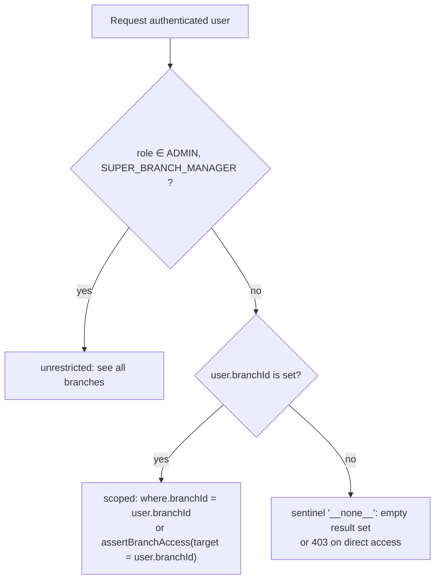

# Reverie Desk — Role & Permission Matrix

This matrix is grounded in the actual `@Roles(...)` decorators on every controller plus the `ROLE_PERMISSION_GRANTS` map in `prisma/seed.ts`.

## Role Inventory

| Role code | Branch scope | Notes |
|---|---|---|
| `ADMIN` | unrestricted | full system access |
| `SUPER_BRANCH_MANAGER` | unrestricted | cross-branch operational role (treated like ADMIN by `branch-scope.ts`) |
| `BRANCH_MANAGER` | scoped to `user.branchId` | runs a single branch |
| `TELESALES` | scoped to `user.branchId` | lead handling |
| `CS` | scoped to `user.branchId` | customer service / front desk |
| `DOCTOR` | scoped to `user.branchId` | clinical execution |
| `EMPLOYEE` | scoped to `user.branchId` | minimal role |
| `CENTRAL_STOCK_HUB` | unrestricted (inventory only) | central warehouse operator |

> "Unrestricted" is enforced by `isUnrestricted(user)` in `src/common/authz/branch-scope.ts` (currently `ADMIN ∪ SUPER_BRANCH_MANAGER`). Other roles are constrained via `assertBranchAccess()` and `scopedBranchFilter()`.

## Permissions

The `Permission` table is seeded once and granted by role:

| Permission code | What it gates |
|---|---|
| `REPORT_VIEW` | `/api/v1/reports/*` |
| `DASHBOARD_VIEW` | `/api/v1/dashboard/*` |
| `AUDIT_VIEW` | `/api/v1/audit/*` |
| `NOTIFICATION_VIEW` | `GET /api/v1/notifications`, `GET /api/v1/notifications/unread-count`, `PATCH …/read-all`, `PATCH …/:id/read` |
| `NOTIFICATION_MANAGE` | `POST /api/v1/notifications` |
| `AUTOMATION_MANAGE` | `GET /api/v1/automation/rules`, `POST /api/v1/automation/run/:code`, `PATCH /api/v1/automation/rules/:code` |

### Permissions by Role (from `prisma/seed.ts`)

| Permission \ Role | ADMIN | SUPER_BRANCH_MANAGER | BRANCH_MANAGER | CS | TELESALES | DOCTOR | EMPLOYEE | CENTRAL_STOCK_HUB |
|---|:---:|:---:|:---:|:---:|:---:|:---:|:---:|:---:|
| `REPORT_VIEW` | ✅ | ✅ | ✅ | ✅ | — | — | — | ✅ |
| `DASHBOARD_VIEW` | ✅ | ✅ | ✅ | ✅ | ✅ | ✅ | — | — |
| `AUDIT_VIEW` | ✅ | ✅ | ✅ | — | — | — | — | — |
| `NOTIFICATION_VIEW` | ✅ | ✅ | ✅ | ✅ | ✅ | ✅ | ✅ | ✅ |
| `NOTIFICATION_MANAGE` | ✅ | ✅ | ✅ | — | — | — | — | — |
| `AUTOMATION_MANAGE` | ✅ | ✅ | — | — | — | — | — | — |

---

## CRUD Permissions per Module

Legend:

- ✅ = role can perform this action
- — = role cannot perform this action
- (own) = action allowed only on rows where the actor is the subject (e.g. `dashboard/doctor/:userId` for the doctor's own user id)
- (scoped) = action restricted to the actor's `branchId`

### Auth (`/auth`)

| Action | ADMIN | SUPER_BRANCH_MANAGER | BRANCH_MANAGER | TELESALES | CS | DOCTOR | EMPLOYEE | CENTRAL_STOCK_HUB |
|---|:---:|:---:|:---:|:---:|:---:|:---:|:---:|:---:|
| `POST /auth/login` | public | public | public | public | public | public | public | public |
| `GET /auth/me` | ✅ | ✅ | ✅ | ✅ | ✅ | ✅ | ✅ | ✅ |

### Users (`/users`)

| Action | ADMIN | SUPER_BRANCH_MANAGER | BRANCH_MANAGER | TELESALES | CS | DOCTOR | EMPLOYEE | CENTRAL_STOCK_HUB |
|---|:---:|:---:|:---:|:---:|:---:|:---:|:---:|:---:|
| Create (`POST /users`) | ✅ | ✅ | — | — | — | — | — | — |
| Read list (`GET /users`, `/by-branch/:branchId`) | ✅ | ✅ | ✅ (scoped) | — | — | — | — | — |
| Read one (`GET /users/:id`) | ✅ | ✅ | ✅ (scoped) | — | — | — | — | — |
| Update (`PATCH /users/:id`) | ✅ | ✅ | — | — | — | — | — | — |
| Assign / unassign branch | ✅ | ✅ | — | — | — | — | — | — |

### Branches (`/branches`)

| Action | ADMIN | SUPER_BRANCH_MANAGER | BRANCH_MANAGER | TELESALES | CS | DOCTOR | EMPLOYEE | CENTRAL_STOCK_HUB |
|---|:---:|:---:|:---:|:---:|:---:|:---:|:---:|:---:|
| Create | ✅ | ✅ | — | — | — | — | — | — |
| Read list | ✅ | ✅ | ✅ | ✅ | ✅ | ✅ | ✅ | ✅ |
| Read one | ✅ | ✅ | ✅ | ✅ | ✅ | ✅ | ✅ | ✅ |
| Update | ✅ | ✅ | — | — | — | — | — | — |
| Activate / Deactivate | ✅ | ✅ | — | — | — | — | — | — |

### Customers (`/customers`)

| Action | ADMIN | SUPER_BRANCH_MANAGER | BRANCH_MANAGER | TELESALES | CS | DOCTOR | EMPLOYEE | CENTRAL_STOCK_HUB |
|---|:---:|:---:|:---:|:---:|:---:|:---:|:---:|:---:|
| Create | ✅ | ✅ | ✅ | ✅ | ✅ | — | — | — |
| Read list / Read one | ✅ | ✅ | ✅ (scoped) | ✅ (scoped) | ✅ (scoped) | ✅ (scoped) | ✅ (scoped) | ✅ (scoped) |
| Update | ✅ | ✅ | ✅ | — | ✅ | — | — | — |
| Soft-delete | ✅ | ✅ | ✅ | — | ✅ | — | — | — |
| Change branch | ✅ | ✅ | ✅ | — | ✅ | — | — | — |

### Leads (`/leads`)

| Action | ADMIN | SUPER_BRANCH_MANAGER | BRANCH_MANAGER | TELESALES | CS | DOCTOR | EMPLOYEE | CENTRAL_STOCK_HUB |
|---|:---:|:---:|:---:|:---:|:---:|:---:|:---:|:---:|
| Create | ✅ | ✅ | ✅ | ✅ | — | — | — | — |
| Read list / Read one | ✅ | ✅ | ✅ (scoped) | ✅ (scoped) | ✅ (scoped) | ✅ (scoped) | ✅ (scoped) | — |
| Assign owner | ✅ | ✅ | ✅ | ✅ | — | — | — | — |
| Update status | ✅ | ✅ | ✅ | ✅ | — | — | — | — |
| Convert | ✅ | ✅ | ✅ | ✅ | ✅ | — | — | — |

### Sales Orders (`/sales-orders`)

| Action | ADMIN | SUPER_BRANCH_MANAGER | BRANCH_MANAGER | TELESALES | CS | DOCTOR | EMPLOYEE | CENTRAL_STOCK_HUB |
|---|:---:|:---:|:---:|:---:|:---:|:---:|:---:|:---:|
| Create | ✅ | ✅ | ✅ | — | ✅ | — | — | — |
| Read list / Read one | ✅ | ✅ | ✅ (scoped) | — | ✅ (scoped) | — | — | — |
| Update (DRAFT only) | ✅ | ✅ | ✅ | — | ✅ | — | — | — |
| Confirm | ✅ | ✅ | ✅ | — | ✅ | — | — | — |
| Cancel | ✅ | ✅ | ✅ | — | ✅ | — | — | — |

### Payments (`/payments`)

| Action | ADMIN | SUPER_BRANCH_MANAGER | BRANCH_MANAGER | TELESALES | CS | DOCTOR | EMPLOYEE | CENTRAL_STOCK_HUB |
|---|:---:|:---:|:---:|:---:|:---:|:---:|:---:|:---:|
| Create | ✅ | ✅ | ✅ | — | ✅ | — | — | — |
| Read list / one | ✅ | ✅ | ✅ (scoped) | — | ✅ (scoped) | — | — | — |

### Refunds (`/refunds`)

| Action | ADMIN | SUPER_BRANCH_MANAGER | BRANCH_MANAGER | TELESALES | CS | DOCTOR | EMPLOYEE | CENTRAL_STOCK_HUB |
|---|:---:|:---:|:---:|:---:|:---:|:---:|:---:|:---:|
| Create | ✅ | ✅ | ✅ | — | ✅ | — | — | — |
| Read list / one | ✅ | ✅ | ✅ (scoped) | ✅ (scoped) | ✅ (scoped) | — | — | — |
| Approve / Reject / Complete | ✅ | ✅ | ✅ | — | — | — | — | — |

### Wallet (`/wallet`)

| Action | ADMIN | SUPER_BRANCH_MANAGER | BRANCH_MANAGER | TELESALES | CS | DOCTOR | EMPLOYEE | CENTRAL_STOCK_HUB |
|---|:---:|:---:|:---:|:---:|:---:|:---:|:---:|:---:|
| Read customer wallets | ✅ | ✅ | ✅ (scoped) | ✅ (scoped) | ✅ (scoped) | ✅ (scoped) | — | — |
| Credit / Debit / Transfer | ✅ | ✅ | ✅ | — | ✅ | — | — | — |

### Commissions (`/commissions`)

| Action | ADMIN | SUPER_BRANCH_MANAGER | BRANCH_MANAGER | TELESALES | CS | DOCTOR | EMPLOYEE | CENTRAL_STOCK_HUB |
|---|:---:|:---:|:---:|:---:|:---:|:---:|:---:|:---:|
| Evaluate (`POST /commissions/evaluate/:salesOrderId`) | ✅ | ✅ | ✅ | — | — | — | — | — |
| Read list / one | ✅ | ✅ | ✅ (scoped) | ✅ (scoped) | ✅ (scoped) | — | — | — |
| Lock | ✅ | ✅ | ✅ | — | — | — | — | — |
| Pay | ✅ | ✅ | ✅ | — | — | — | — | — |

### Commission Rules (`/commission-rules`)

| Action | ADMIN | SUPER_BRANCH_MANAGER | BRANCH_MANAGER | TELESALES | CS | DOCTOR | EMPLOYEE | CENTRAL_STOCK_HUB |
|---|:---:|:---:|:---:|:---:|:---:|:---:|:---:|:---:|
| Read list (`GET`) | ✅ | ✅ | ✅ | — | ✅ | — | — | — |
| Create / Update / Delete (soft) | ✅ | ✅ | ✅ | — | — | — | — | — |
| Bulk-upsert | ✅ | ✅ | ✅ | — | — | — | — | — |
| Calculate (preview) | ✅ | ✅ | ✅ | — | ✅ | — | — | — |

### Appointments (`/appointments`)

| Action | ADMIN | SUPER_BRANCH_MANAGER | BRANCH_MANAGER | TELESALES | CS | DOCTOR | EMPLOYEE | CENTRAL_STOCK_HUB |
|---|:---:|:---:|:---:|:---:|:---:|:---:|:---:|:---:|
| Create | ✅ | ✅ | ✅ | — | ✅ | ✅ | — | — |
| Read list / one | ✅ | ✅ | ✅ (scoped) | — | ✅ (scoped) | ✅ (scoped) | — | — |
| Check-in | ✅ | ✅ | ✅ | — | ✅ | ✅ | — | — |
| Complete | ✅ | ✅ | ✅ | — | ✅ | ✅ | — | — |
| Cancel | ✅ | ✅ | ✅ | — | ✅ | ✅ | — | — |
| Reschedule | ✅ | ✅ | ✅ | — | ✅ | ✅ | — | — |

### Service Events (`/service-events`)

| Action | ADMIN | SUPER_BRANCH_MANAGER | BRANCH_MANAGER | TELESALES | CS | DOCTOR | EMPLOYEE | CENTRAL_STOCK_HUB |
|---|:---:|:---:|:---:|:---:|:---:|:---:|:---:|:---:|
| Create | ✅ | ✅ | ✅ | — | — | ✅ | — | — |
| Read list / one / by customer | ✅ | ✅ | ✅ (scoped) | — | ✅ (scoped) | ✅ (scoped) | — | — |
| Consume stock / Stock usage | ✅ | ✅ | ✅ | — | — | ✅ | — | — |
| Complete | ✅ | ✅ | ✅ | — | — | ✅ | — | — |

### Treatment Entitlements (`/customers/:id/entitlements`, `/entitlements/...`, `/appointments/:id/consume`)

| Action | ADMIN | SUPER_BRANCH_MANAGER | BRANCH_MANAGER | TELESALES | CS | DOCTOR | EMPLOYEE | CENTRAL_STOCK_HUB |
|---|:---:|:---:|:---:|:---:|:---:|:---:|:---:|:---:|
| Read entitlements | ✅ | ✅ | ✅ (scoped) | — | ✅ (scoped) | ✅ (scoped) | — | — |
| Consume (`POST /appointments/:id/consume`) | ✅ | ✅ | ✅ | — | — | ✅ | — | — |
| Expire (`PATCH /entitlements/:id/expire`) | ✅ | ✅ | ✅ | — | — | — | — | — |

### Inventory — Units (`/units`)

| Action | ADMIN | SUPER_BRANCH_MANAGER | BRANCH_MANAGER | TELESALES | CS | DOCTOR | EMPLOYEE | CENTRAL_STOCK_HUB |
|---|:---:|:---:|:---:|:---:|:---:|:---:|:---:|:---:|
| Create / Update / Delete | ✅ | ✅ | — | — | — | — | — | ✅ |
| Read list / one | ✅ | ✅ | ✅ | — | ✅ | ✅ | — | ✅ |

### Inventory — Suppliers (`/suppliers`)

| Action | ADMIN | SUPER_BRANCH_MANAGER | BRANCH_MANAGER | TELESALES | CS | DOCTOR | EMPLOYEE | CENTRAL_STOCK_HUB |
|---|:---:|:---:|:---:|:---:|:---:|:---:|:---:|:---:|
| Create / Update | ✅ | ✅ | — | — | — | — | — | ✅ |
| Read list / one | ✅ | ✅ | ✅ | — | ✅ | ✅ | — | ✅ |

### Inventory — Stock Items (`/stock-items`)

| Action | ADMIN | SUPER_BRANCH_MANAGER | BRANCH_MANAGER | TELESALES | CS | DOCTOR | EMPLOYEE | CENTRAL_STOCK_HUB |
|---|:---:|:---:|:---:|:---:|:---:|:---:|:---:|:---:|
| Create / Update / Soft-delete | ✅ | ✅ | — | — | — | — | — | ✅ |
| Read list / one | ✅ | ✅ | ✅ | — | ✅ | ✅ | — | ✅ |

### Inventory — Purchase Receipts (`/purchase-receipts`)

| Action | ADMIN | SUPER_BRANCH_MANAGER | BRANCH_MANAGER | TELESALES | CS | DOCTOR | EMPLOYEE | CENTRAL_STOCK_HUB |
|---|:---:|:---:|:---:|:---:|:---:|:---:|:---:|:---:|
| Create | ✅ | ✅ | — | — | — | — | — | ✅ |
| Read list / one | ✅ | ✅ | ✅ | — | ✅ | ✅ | — | ✅ |

### Inventory — Stock Lots (`/stock-lots`)

| Action | ADMIN | SUPER_BRANCH_MANAGER | BRANCH_MANAGER | TELESALES | CS | DOCTOR | EMPLOYEE | CENTRAL_STOCK_HUB |
|---|:---:|:---:|:---:|:---:|:---:|:---:|:---:|:---:|
| Receive (`POST /stock-lots/receive`) | ✅ | ✅ | — | — | — | — | — | ✅ |
| Read list / one / expiring | ✅ | ✅ | ✅ | — | ✅ | ✅ | — | ✅ |

### Inventory — Stock Transfers (`/stock-transfers`)

| Action | ADMIN | SUPER_BRANCH_MANAGER | BRANCH_MANAGER | TELESALES | CS | DOCTOR | EMPLOYEE | CENTRAL_STOCK_HUB |
|---|:---:|:---:|:---:|:---:|:---:|:---:|:---:|:---:|
| Create / Request | ✅ | ✅ | ✅ | — | — | — | — | ✅ |
| Approve | ✅ | ✅ | — | — | — | — | — | ✅ |
| Dispatch | ✅ | ✅ | ✅ | — | — | — | — | ✅ |
| Receive | ✅ | ✅ | ✅ | — | — | — | — | ✅ |
| Cancel | ✅ | ✅ | ✅ | — | — | — | — | ✅ |
| Read list / one | ✅ | ✅ | ✅ | — | ✅ | ✅ | — | ✅ |

### Inventory — Opened Containers (`/opened-containers`)

| Action | ADMIN | SUPER_BRANCH_MANAGER | BRANCH_MANAGER | TELESALES | CS | DOCTOR | EMPLOYEE | CENTRAL_STOCK_HUB |
|---|:---:|:---:|:---:|:---:|:---:|:---:|:---:|:---:|
| Open / Use / Discard / Expire | ✅ | ✅ | ✅ | — | — | ✅ | — | ✅ |
| Read list / one | ✅ | ✅ | ✅ | — | ✅ | ✅ | — | ✅ |

### Inventory — Expiry Sweep Admin (`/admin/expiry-sweep/run`)

| Action | ADMIN | SUPER_BRANCH_MANAGER | BRANCH_MANAGER | TELESALES | CS | DOCTOR | EMPLOYEE | CENTRAL_STOCK_HUB |
|---|:---:|:---:|:---:|:---:|:---:|:---:|:---:|:---:|
| Run (POST) | ✅ | ✅ | — | — | — | — | — | ✅ |

### Branch Stock Sales (`/branch-stock-sales`)

| Action | ADMIN | SUPER_BRANCH_MANAGER | BRANCH_MANAGER | TELESALES | CS | DOCTOR | EMPLOYEE | CENTRAL_STOCK_HUB |
|---|:---:|:---:|:---:|:---:|:---:|:---:|:---:|:---:|
| Create / Pay / Complete / Cancel / Refund (request) | ✅ | ✅ | ✅ | — | ✅ | — | — | — |
| Approve refund | ✅ | ✅ | ✅ | — | — | — | — | — |
| Read list / one | ✅ | ✅ | ✅ (scoped) | — | ✅ (scoped) | — | — | — |

### Targets (`/targets`)

| Action | ADMIN | SUPER_BRANCH_MANAGER | BRANCH_MANAGER | TELESALES | CS | DOCTOR | EMPLOYEE | CENTRAL_STOCK_HUB |
|---|:---:|:---:|:---:|:---:|:---:|:---:|:---:|:---:|
| Create | ✅ | ✅ | ✅ | — | — | — | — | — |
| Update | ✅ | ✅ | ✅ | — | — | — | — | — |
| Read for quarter / progress | ✅ | ✅ | ✅ (scoped) | ✅ (scoped) | ✅ (scoped) | ✅ (scoped) | ✅ (scoped) | ✅ (scoped) |

### Reports (`/reports/*`) — gated by `REPORT_VIEW`

| Endpoint group | ADMIN | SUPER_BRANCH_MANAGER | BRANCH_MANAGER | TELESALES | CS | DOCTOR | EMPLOYEE | CENTRAL_STOCK_HUB |
|---|:---:|:---:|:---:|:---:|:---:|:---:|:---:|:---:|
| `GET /reports/sales`, `/payments`, `/service-events`, `/appointments`, `/inventory`, `/commissions`, `/wallets` | ✅ | ✅ | ✅ (scoped) | — | ✅ (scoped) | — | — | ✅ |

### Dashboards (`/dashboard/*`) — gated by `DASHBOARD_VIEW`

| Endpoint | ADMIN | SUPER_BRANCH_MANAGER | BRANCH_MANAGER | TELESALES | CS | DOCTOR | EMPLOYEE | CENTRAL_STOCK_HUB |
|---|:---:|:---:|:---:|:---:|:---:|:---:|:---:|:---:|
| `GET /dashboard/executive` | ✅ | ✅ | ✅ (scoped data) | ✅ (scoped data) | ✅ (scoped data) | ✅ (scoped data) | — | — |
| `GET /dashboard/branch/:branchId` | ✅ | ✅ | ✅ (own branch) | ✅ (own branch) | ✅ (own branch) | ✅ (own branch) | — | — |
| `GET /dashboard/doctor/:userId` | ✅ | ✅ | ✅ (scoped) | — | ✅ (scoped) | ✅ (own) | — | — |
| `GET /dashboard/telesales/:userId` | ✅ | ✅ | ✅ (scoped) | ✅ (own) | ✅ (scoped) | — | — | — |

> Note: branch-scoped roles see metrics aggregated for their own branch only; doctor/telesales user-specific dashboards require the requested userId to match the actor or for the actor to be unrestricted/in the same branch.

### Audit (`/audit/*`) — gated by `AUDIT_VIEW`

| Action | ADMIN | SUPER_BRANCH_MANAGER | BRANCH_MANAGER | TELESALES | CS | DOCTOR | EMPLOYEE | CENTRAL_STOCK_HUB |
|---|:---:|:---:|:---:|:---:|:---:|:---:|:---:|:---:|
| Search (`GET /audit`) | ✅ | ✅ | ✅ (own branch) | — | — | — | — | — |
| Entity timeline | ✅ | ✅ | ✅ (own branch) | — | — | — | — | — |
| User activity | ✅ | ✅ | ✅ (same branch only) | — | — | — | — | — |

### Notifications (`/notifications/*`)

| Action | ADMIN | SUPER_BRANCH_MANAGER | BRANCH_MANAGER | TELESALES | CS | DOCTOR | EMPLOYEE | CENTRAL_STOCK_HUB |
|---|:---:|:---:|:---:|:---:|:---:|:---:|:---:|:---:|
| List own / unread count / mark read / mark-all read (`NOTIFICATION_VIEW`) | ✅ | ✅ | ✅ | ✅ | ✅ | ✅ | ✅ | ✅ |
| Compose / broadcast (`POST /notifications`, `NOTIFICATION_MANAGE`) | ✅ | ✅ | ✅ | — | — | — | — | — |

### Automation (`/automation/*`) — gated by `AUTOMATION_MANAGE`

| Action | ADMIN | SUPER_BRANCH_MANAGER | BRANCH_MANAGER | TELESALES | CS | DOCTOR | EMPLOYEE | CENTRAL_STOCK_HUB |
|---|:---:|:---:|:---:|:---:|:---:|:---:|:---:|:---:|
| List rules / Run rule / Toggle enabled | ✅ | ✅ | — | — | — | — | — | — |

### Health (`/health/*`) — public

All probes are public and `VERSION_NEUTRAL`.

---

## Branch-Scoping Rules

Implemented in `src/common/authz/branch-scope.ts`:

Practical implications:

- A `BRANCH_MANAGER` whose `branchId` is `null` (e.g. just created, not yet assigned) sees zero data instead of system-wide data.
- An unrestricted user explicitly passing `?branchId=<other branch>` sees only that branch's data.
- Branch-scoped users that explicitly pass a different `branchId` get an empty result set (audit search) or `403 Forbidden` (mutation endpoints that call `assertBranchAccess`).

---

## Special Throttling

| Endpoint group | Limit (per minute, default) |
|---|---|
| Global default | 100 |
| `POST /auth/login` | 5 |
| Audit + Automation admin endpoints | 50 |

The throttler can be globally disabled via `THROTTLE_DISABLED=true` (smoke tests, CI). Health checks are excluded via `@SkipThrottle()`.
