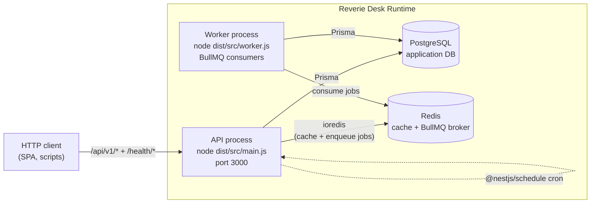
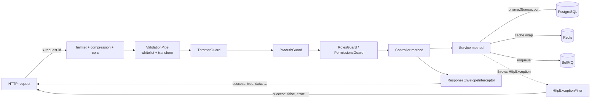
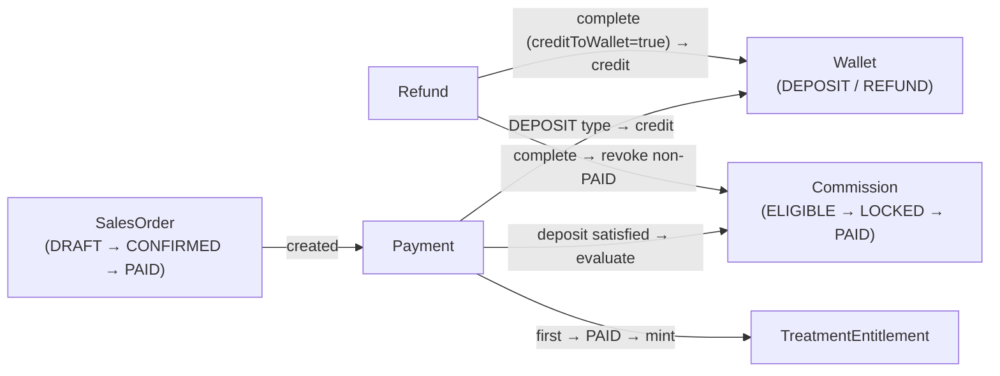
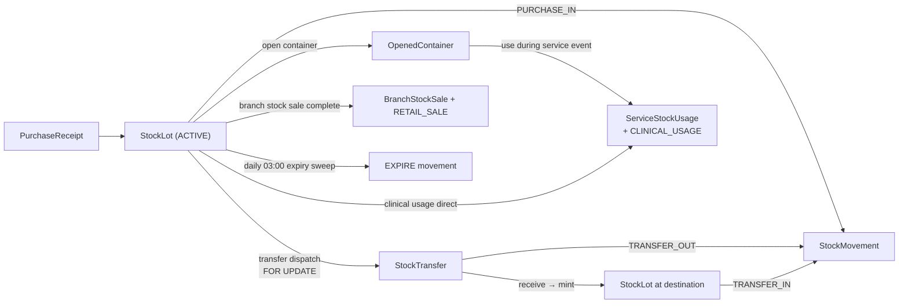
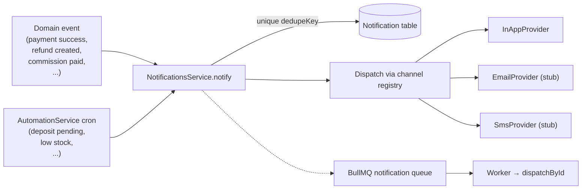

# Reverie Desk — System Overview

## 1. Project Purpose

Reverie Desk is a multi-branch **clinic / aesthetic-medicine ERP** that tracks every step from prospect to post-treatment, including:

- CRM funnel (Lead → Customer)
- Service sales (`SalesOrder`, `Payment`, deposits, partial payments)
- Clinical operations (Appointments, Service Events, Doctor / Employee execution)
- Pre-paid treatment programs (session-based packages with entitlement drawdown)
- Inventory ledger (Purchase receipts, Stock lots, Transfers between warehouses, Opened multi-use containers, Expiry sweeps)
- Branch retail walk-in sales of consumables (Branch Stock Sales)
- Commission engine (tiered, by branch + service group)
- Refunds with automatic commission revocation and wallet credits
- Customer wallet ledger (deposits, transfers, refunds)
- Quarterly revenue target planning and progress tracking
- Reporting, dashboards, and an immutable audit trail
- Notification + automation engine (cron rules + event-driven hooks)

Every business write is audited; every financial operation is wrapped in a `prisma.$transaction`.

---

## 2. Architecture Style

| Concern | Choice |
|---|---|
| Architectural pattern | **Modular monolith** with strict module boundaries (NestJS `@Module`s) |
| Layering | Controller → Service → Prisma (no separate repository layer) |
| Authentication | Stateless **JWT** (Passport) |
| Authorization | Role guard (`@Roles`) + Permission guard (`@RequirePermission`) + branch-scoping helpers |
| Persistence | **PostgreSQL** via Prisma ORM (advisory locks for sequential numbering) |
| Caching | Redis-backed `CacheService` with in-memory fallback |
| Async work | **BullMQ** with three queues (notification, automation, reporting) |
| Background scheduling | `@nestjs/schedule` cron + a separate worker process |
| API style | REST, JSON-only, URI versioning (`/api/v1`) |
| Response shape | Standard success/error envelope (global interceptor + filter) |
| Observability | `nestjs-pino` structured logs + correlation ID per request |
| Health probes | `@nestjs/terminus` (`/health`, `/health/live`, `/health/ready`) |

The core architectural rule: **every cross-module write happens inside one transaction**. Modules export `*With(tx, …)` helpers when they need to participate in a parent module's transaction (payments, refunds, commissions, wallet, treatment entitlements all expose this pattern).

---

## 3. Tech Stack

### Runtime

- **Node.js** (>= 20)
- **NestJS 11** (`@nestjs/common`, `@nestjs/core`, `@nestjs/platform-express`)
- **TypeScript 5.7**

### Persistence & Caching

- **Prisma 7.8** + `@prisma/adapter-pg` (PostgreSQL driver via `pg` 8.x)
- **Redis** via `ioredis` (optional in dev — code degrades gracefully)

### HTTP, Auth, Validation

- `helmet`, `compression`, `cors`
- `@nestjs/jwt` + `@nestjs/passport` + `passport-jwt`
- `bcrypt` (cost 12) for password hashing
- `class-validator`, `class-transformer`
- `joi` for env-var validation
- `libphonenumber-js` (Thai phone validation)

### Async / Jobs

- **BullMQ 5** + `@nestjs/bullmq`
- **`@nestjs/schedule`** (cron host)

### Observability & Docs

- `nestjs-pino`, `pino-http`, `pino-pretty`
- `@nestjs/swagger` + `swagger-ui-express` → `/api/docs`
- `@nestjs/terminus` health checks
- `@nestjs/throttler` (rate limiting)

### Tooling

- Jest (unit + e2e), `supertest`
- `tsx` for live smoke scripts (`scripts/smoke-*.ts`)
- ESLint + Prettier
- `@redocly/cli` and `@openapitools/openapi-generator-cli` for OpenAPI bundling/codegen

---

## 4. Runtime Services

A full deployment runs **four logical processes**:



Notes:

- The API process **also** runs cron jobs (`@nestjs/schedule`) for automation rules and the daily expiry sweep. The dedicated **worker** process consumes BullMQ queues so heavy work (notification dispatch, automation execution stub, reporting precomputation stub) can be scaled horizontally independently of the API.
- `WORKER_MODE=embedded` (`src/main.ts`) collapses worker startup into the API process for single-host deployments — useful for low-traffic environments and local development.
- Redis is **optional** at runtime: when `REDIS_HOST` is unset the cache uses an in-memory LRU fallback and `QueueService.enqueue*` becomes a no-op (with a debug log). Production must configure Redis.

### Health endpoints

| Path | Description |
|---|---|
| `GET /health` | Aggregated liveness + readiness probe |
| `GET /health/live` | Liveness only (process up) |
| `GET /health/ready` | Readiness — DB + Redis (when configured) |

`/health/*` is `VERSION_NEUTRAL` and is excluded from the `/api` prefix and the global throttler.

---

## 5. Deployment Model

### Local development

```bash
npm install
npx prisma migrate dev          # runs all migrations under prisma/migrations/
npm run seed                    # roles + permissions + admin user + base branch/warehouses
npm run start:dev               # API on :3000 with hot reload
npm run worker:dev              # Optional: BullMQ workers in a separate terminal
```

### Container-based

`Dockerfile` (multi-stage build, deterministic Prisma binary), `docker-compose.yml`, and `docker-compose.prod.yml` run **api + worker + postgres + redis** as separate services.

```bash
npm run docker:up
npm run docker:logs
```

### Migrations and database safety

- `prisma migrate deploy` runs on each deploy (`npm run db:migrate`).
- `npm run db:check` verifies the running schema matches the codebase (`scripts/db-check.ts`).
- `npm run db:backup` performs a logical backup (`scripts/db-backup.ts`).

### CI/CD

- GitHub Actions: `.github/workflows/ci.yml` (lint + test + build on PR), `deploy.yml` for tagged releases.
- Target host platform: **Render.com** Docker deploys (`render.yaml` is the recommended manifest).

### Environment

Joi-validated env vars (`src/config/env.validation.ts`):

| Var | Required | Default | Notes |
|---|---|---|---|
| `NODE_ENV` | no | `development` | one of `development`/`staging`/`production`/`test` |
| `PORT` | no | `3000` | |
| `DATABASE_URL` | **yes** | — | `postgres://` URI |
| `JWT_SECRET` | **yes** | — | min 16 chars |
| `JWT_EXPIRES_IN` | **yes** | — | e.g. `12h` |
| `REDIS_HOST` / `REDIS_PORT` / `REDIS_PASSWORD` / `REDIS_DB` / `REDIS_TLS` | no | — / 6379 / — / 0 / `false` | Optional. Without `REDIS_HOST` cache + queue degrade gracefully |
| `LOG_LEVEL` | no | `info` | pino levels |
| `CACHE_TTL_SECONDS` / `CACHE_DASHBOARD_TTL_SECONDS` / `CACHE_REPORT_TTL_SECONDS` | no | 60 / 30 / 300 | |
| `LOW_STOCK_THRESHOLD` | no | `5` | automation rule |
| `EXPIRY_ALERT_DAYS` | no | `30` | automation rule |
| `LEAD_FOLLOWUP_HOURS` | no | `48` | automation rule |
| `APPOINTMENT_REMINDER_WINDOW_HOURS` | no | `24` | automation rule |
| `WALLET_EXPIRY_NOTICE_DAYS` | no | `7` | automation rule |
| `AUTOMATION_DISABLED` | no | `''` | CSV of rule codes to disable |
| `ENABLE_QUEUES` | no | `true` | global on/off for BullMQ producers |
| `ENABLE_REQUEST_LOGGING` | no | `true` | pino-http on/off |
| `CORS_ORIGINS` | no | `*` | CSV |
| `THROTTLE_DEFAULT_LIMIT` / `THROTTLE_AUTH_LIMIT` / `THROTTLE_ADMIN_LIMIT` / `THROTTLE_TTL_MS` / `THROTTLE_DISABLED` | no | 100 / 5 / 50 / 60000 / `false` | |

---

## 6. Data Flow Summary

### Request path



### Money flow (Sales → Payment → Commission → Refund)



### Stock flow



### Notification fan-out



### Audit

Every state-changing service call emits an `AuditLog` row through `AuditService.record()` or `recordWith(tx, …)`. The non-transactional path swallows audit failures (logs only) so audit availability never blocks business writes. Audit entries record `actorUserId`, `branchId`, `entityType`, `entityId`, `action`, and a JSON `payload` snapshot.

---

## 7. Key Cross-Cutting Conventions

- **Standard envelopes**:
  - Success: `{ "success": true, "data": <payload> }`
  - Error: `{ "success": false, "error": { "statusCode", "code", "message", "details?", "path", "timestamp", "correlationId" } }`
- **Pagination**: `{ data: T[], meta: { page, limit, total } }`. Defaults: `page=1`, `limit=20`.
- **Branch scoping**: `ADMIN` and `SUPER_BRANCH_MANAGER` are unrestricted. Other roles are constrained to `user.branchId` via `assertBranchAccess()` and `scopedBranchFilter()` (`src/common/authz/branch-scope.ts`). A branch-scoped user with `branchId == null` sees zero results (sentinel `'__none__'`).
- **Soft delete**: `deletedAt` columns on `Customer`, `StockItem`, `Service`, etc. Listings filter these out.
- **Concurrency**: Postgres `pg_advisory_xact_lock(hashtext(key))` for sequential code generators; `SELECT … FOR UPDATE` for stock lot / opened container atomic decrements; raw SQL guarded `UPDATE` for entitlement drawdown.
- **Idempotency**: `Notification.dedupeKey @unique`, `TreatmentEntitlement.salesOrderItemId @unique`, `Appointment.entitlementConsumedAt`, commission snapshot `(salesOrderId, serviceGroupCode, commissionType)` dedup.
- **Status transition tables** (`ALLOWED_TRANSITIONS`) live next to the service implementing them (sales-orders, appointments, stock-transfers, branch-stock-sales, refunds, commissions). All reject illegal transitions with `BAD_REQUEST`.
